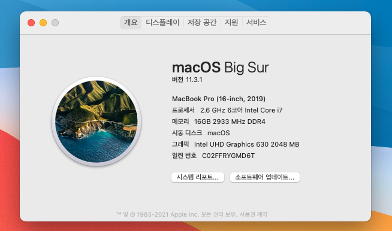

# Razerblade2020-Hackintosh 

Hackintosh guide for Razerblade 2020 model (includes base, advanced, pro) 
If you have question, You can open the issue. (But I'm beginner so It's not very helpful) 
And content additions and corrections are always welcome :) Please fix the awkward English
## Intro
This repository will guide you to install macOS bigsur on your razerblade.

EFI folder based on [steelbrain's hackintosh guide](https://github.com/steelbrain/razer-blade-17-pro-2020-hackintosh) ;) 
(I modified little bit that repository for bigsur)

sorry for awkard English! If you good at Korean, plz read korean guide instead (작성중이니까 기다려주세여) lol

## Supplies
* your RazerBlade 2020 (It doesn't matter if it's base or advanced or pro)
* USB flash drive (16GB or more, represent 32GB)
* CH341a hardware programmer
* SOP8 clip for CH341a
* SSD (not PM981 or PM991)
* considerable patience and courage

## Make install USB via VMware
Follow [this guide](https://www.geekrar.com/install-macos-catalina-on-vmware-on-windows-pc/) to install macOS on VMware.

Until downloading and Installing VMware and macOS, you have to make EFI partition on your USB drive. Follow [this](https://superuser.com/questions/1308324/create-efi-partition-before-installing-windows-10)

Open macOS on VMware, format your USB drive to APFS and make boot USB with [this guide](https://support.apple.com/ko-kr/HT201372)

Mount USB drive's EFI partiton via follow [this guide](https://hologos.github.io/how-to-mount-efi-from-command-line-terminal/)

Add EFI folder on this repository to your USB drive's EFI partition

## Modify BIOS, Add SSD
If you plug your macOS boot USB and boot your laptop with it, the macOS installer will not work.

To fix this, we have to change DVMT settings on BIOS setup.  
But Razer locked that so we have to modify BIOS.

Unfortunatly, Razer locked BIOS on RazerBlade 2020 version, so you cant flash modified BIOS with AFUWINGUI.

So you have to flash modified BIOS with CH341a and SOP8 clip.

Download original BIOS ROM file from RazerUpdater or read your BIOS with AFUWINGUI 
Modify your BIOS with AMIBCP(v5.02 recommended) to unlock DVMT option. 
And flash your modified BIOS with CH341a hardware programmer. [This will help you](http://forum.notebookreview.com/threads/razer-bios-mods-potential-to-unlock-all-hidden-options.830993/page-26)

Also, you should add SSD on blank M.2 slot. macOS will not install on RazerBlade's PM981.

## Install macOS
Enter your BIOS setup. change DVMT pre-alloc to 64MB, and change DVMT max-alloc to MAX.

Plug your USB drive, select Big Sur installer, and install macOS.

Your PC can reboot several times when installing.

And.. Done! Enjoy your new MacBlade! :)
