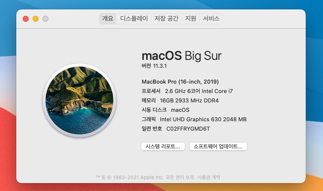

# Razerblade2020-Hackintosh 

레이저 블레이드 2020 모델을 위한 해킨토시 설치 가이드입니다 (base, pro, advanced 다 상관 없어요) 
만약 질문이 있으시다면, 이슈 열어주시면 됩니다 (근데 저도 초보자여서 별로 도움 안될 듯) 
그리고 콘텐츠 수정이나 추가는 항상 환영입니다 ^^
## Intro
이 레포지토리는 레이저 블레이드에 해킨토시 (Big Sur)를 설치하기 위한 가이드를 제공합니다.

EFI 폴더는 이걸 기반으로 구성했습니다 -> [steelbrain's hackintosh guide](https://github.com/steelbrain/razer-blade-17-pro-2020-hackintosh) ;) 
(빅서에 쓸려고 약간 수정했어요)

## 이런것들이 작동합니다!
* 144Hz 디스플레이 (300Hz는 모르겠는데 아마 작동할듯)
* 내장그래픽 (Intel UHD Graphics 630)
* 오디오
* 배터리 잔량확인
* 터치패드
* USB 포트
* 블루투스
* 와이파이
* Sidecar 링 Airplay
* iCloud
## 근데 이건 안되요
* 잠자기는 작동은 하는데 잘 되지는 안습니다.
* 외장그래픽 (ex. 2070 Max-q)
* 에어드랍
## 준비물
* 님의 RazerBlade 2020 (모델은 상관없어요)
* USB (16기가 이상, 32기가 추천)
* CH341a 롬라이터
* CH341a용 SOP8 클립
* SSD (PM981 랑 PM991는 안되요)
* 상당한 인내심과 용기

## VMware로 설치USB만들기
Follow [this guide](https://www.geekrar.com/install-macos-catalina-on-vmware-on-windows-pc/) to install macOS on VMware.

Until downloading and Installing VMware and macOS, you have to make EFI partition on your USB drive. Follow [this](https://superuser.com/questions/1308324/create-efi-partition-before-installing-windows-10)

Open macOS on VMware, format your USB drive to APFS and make boot USB with [this guide](https://support.apple.com/ko-kr/HT201372)

Mount USB drive's EFI partiton via follow [this guide](https://hologos.github.io/how-to-mount-efi-from-command-line-terminal/)

Add EFI folder on this repository to your USB drive's EFI partition

## BIOS 수정하고 SSD 꼽기
If you plug your macOS boot USB and boot your laptop with it, the macOS installer will not work.

To fix this, we have to change DVMT settings on BIOS setup.  
But Razer locked that so we have to modify BIOS.

Unfortunatly, Razer locked BIOS on RazerBlade 2020 version, so you cant flash modified BIOS with AFUWINGUI.

So you have to flash modified BIOS with CH341a and SOP8 clip.

Download original BIOS ROM file from RazerUpdater or read your BIOS with AFUWINGUI 
Modify your BIOS with AMIBCP(v5.02 recommended) to unlock DVMT option. 
And flash your modified BIOS with CH341a hardware programmer. [This will help you](http://forum.notebookreview.com/threads/razer-bios-mods-potential-to-unlock-all-hidden-options.830993/page-26)

Also, you should add SSD on blank M.2 slot. macOS will not install on RazerBlade's PM981.

## macOS 설치하기
Enter your BIOS setup. change DVMT pre-alloc to 64MB, and change DVMT max-alloc to MAX.

Plug your USB drive, select Big Sur installer, and install macOS.

Your PC can reboot several times when installing.

And.. Done! Enjoy your new MacBlade! :)

## 멀티부팅을 위한 GRUB설정
If you want multibooting macOS and Linux(and Windows) and yout dont want to use OpenCore 
You can set GRUB on Linux for it.
[Reddit will help](https://www.reddit.com/r/hackintosh/comments/kdp0ua/opencore_and_grub/)

I'll write guide for it someday later.
